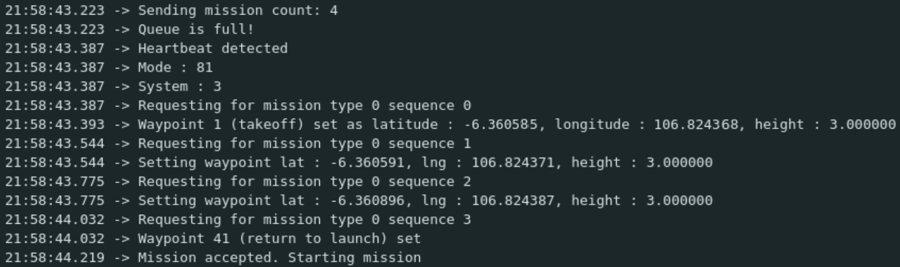

# ESP32 MAVLink

ESP32 MAVLink is a modified version of the [MAVLink C Library v2](https://github.com/mavlink/c_library_v2) that is compatible with the ESP32 platform. This library is meant to be used with the [Cigritous Project](https://github.com/rotary-auav-ui/cigritous/tree/ground-module) and tested with the [ESP32 DevKitC](https://www.espressif.com/en/products/devkits/esp32-devkitc/overview). Connect the ESP32 to the drone using a telemtry via TX2 and RX2 pins. Meanwhile, the telemetry on the drone should be connected to TELEM1 port. The ESP32 will be used to send commands to the drone and receive telemetry data from the drone. The ESP32 will act as the Ground Control Station (GCS) for the drone. 

This library was build for the AUTO/MISSION mode of the drone. The drone will be able to takeoff, fly to a waypoint, and land. The drone will also be able to receive commands from the ESP32 to change the flight mode. The ESP32 will be able to receive telemetry data from the drone such as the drone's position, attitude, and battery level.

## Requirements
- [ESP32 DevKitC](https://www.espressif.com/en/products/devkits/esp32-devkitc/overview)

This is the only hardware this was tested. Other similar ESP32 boards should work as well.
- [Telemetry Radio](https://holybro.com/products/sik-telemetry-radio-v3)

The link above redirects to the Holybro telemtry radio. This is the only telemetry radio this was tested. Other similar telemetry radios should work as well.

## Installation

If you are using the [Cigritous Project](https://github.com/rotary-auav-ui/cigritous/tree/ground-module) then you can skip this step because the library is already included in the project. If you are using this library in your own project, you can install it by cloning this repository into your project's `libraries` folder.

## Usage

Include the [mavlink_commands](https://github.com/rotary-auav-ui/ESP32-MAVLink/blob/main/mavlink_commands.hpp) header file.
```
#include <mavlink_commands.hpp>
```

Create a `MAVLink` object or choose any name you like. Recommended to be in the global scope in the form of a shared pointer. Example :
```
#include <mavlink_commands.hpp>

std::shared_ptr<MAVLink> mavlink;

void setup(){
    mavlink = std::make_shared<MAVLink>(57600, 16, 17);
}
```

The `MAVLink` constructor takes 3 parameters. The first parameter is the baud rate of the serial communication. The second and third parameters are the TX and RX pins of the ESP32. The default baud rate is 57600. The default TX and RX pins are 16 and 17 respectively.

Add waypoint using the add_waypoint function. The add_waypoint function takes 3 parameters. The first parameter is the latitude of the waypoint. The second parameter is the longitude of the waypoint. The third parameter is the altitude of the waypoint. The altitude is in meters. Example :
```
mavlink->add_waypoint(14.599512, 120.984222, 10);
```
Or it is overloaded to use the default fly altitude. The default fly altitude can be set using the set_fly_alt function. The set_fly_alt function takes 1 parameter. The parameter is the altitude in meters. Example :
```
mavlink->set_fly_alt(10);
```
Then, you can use the add_waypoint function without the altitude parameter. Example :
```
mavlink->add_waypoint(14.599512, 120.984222);
```

Once all waypoints needed are added, you can send the mission using the send_mission function. Example :
```
mavlink->send_mission();
```

If the mission upload process is successful, you should see this message in the serial monitor :


To start the mission, you can use the start_mission function. Example :
```
mavlink->start_mission();
```

The drone will arm itself and change mode to AUTO. The drone will then fly to the first waypoint. Once the drone reaches the first waypoint, it will fly to the next waypoint and so on. Once the drone reaches the last waypoint, it will return to home position and land.

### More detailed explanation on how the communication works can be found [here](https://mavlink.io/)

